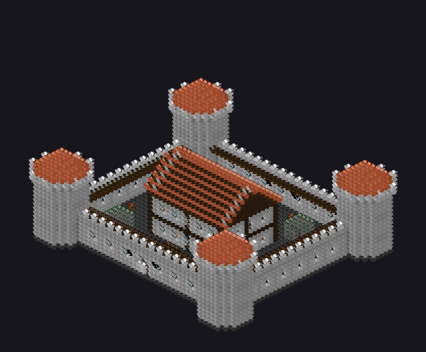
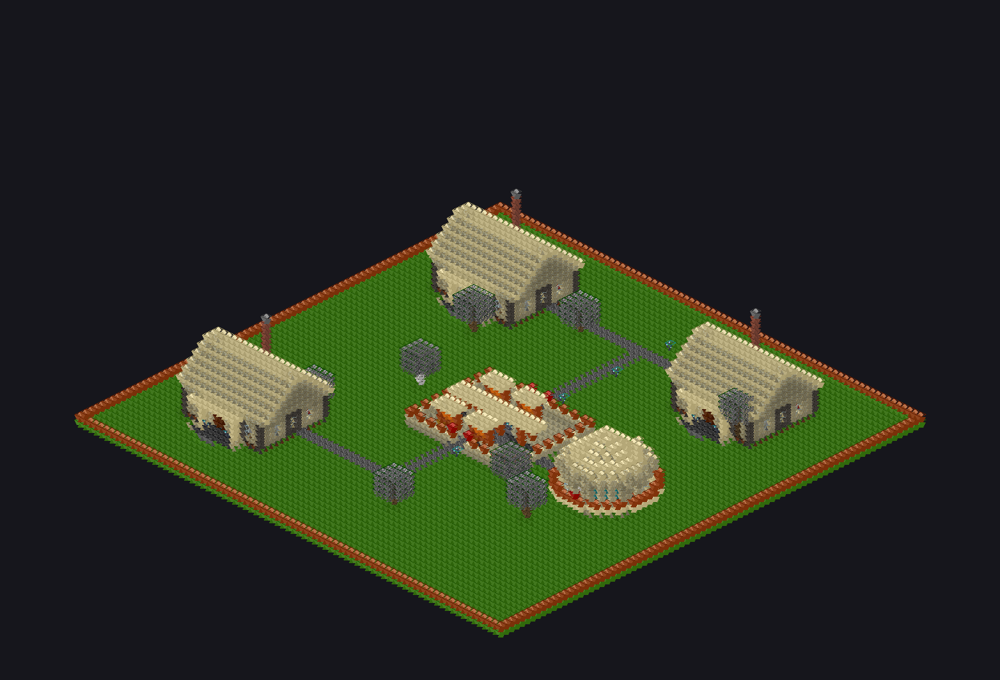
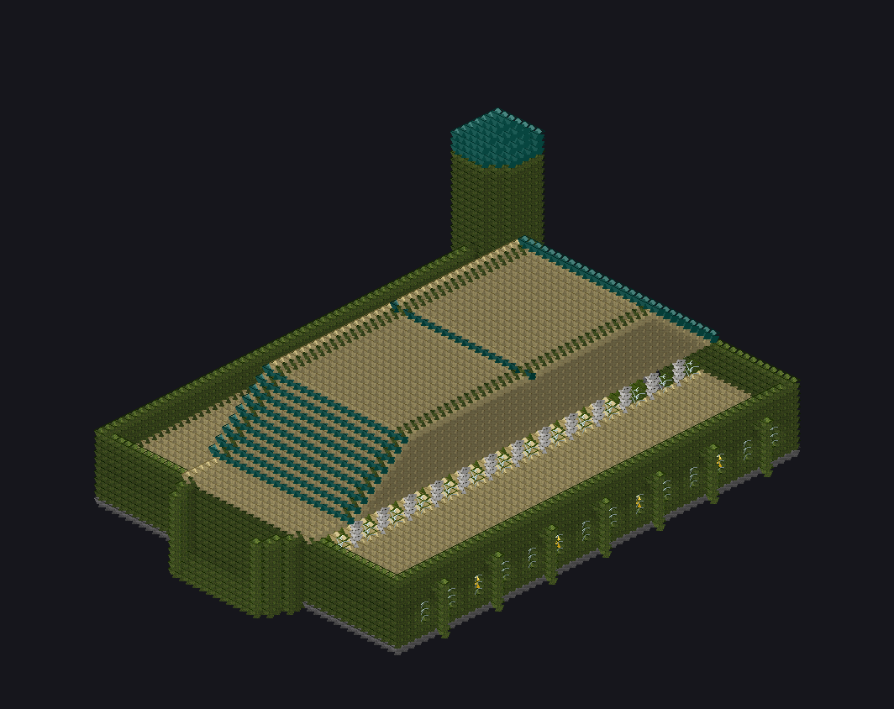
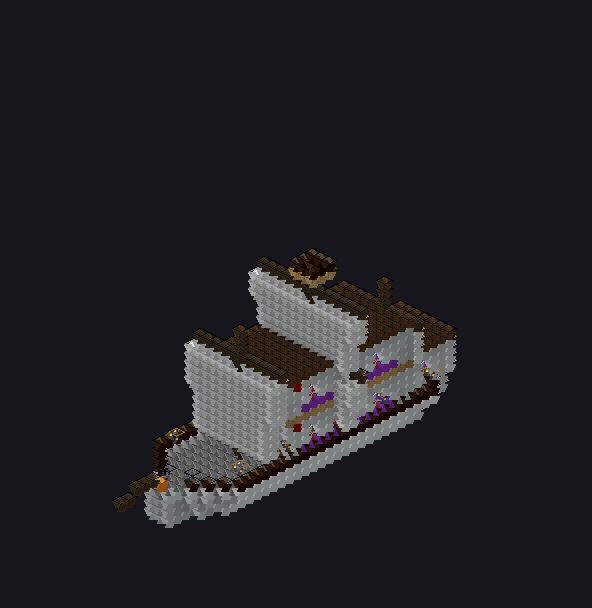

# craftmatic

Minecraft schematic toolkit — parse, generate, render, and convert `.schem` files.

<p align="center">
  
  
</p>
<p align="center">
  
  
</p>

> Textured isometric renders — 334 Faithful 32x textures, 10 structure types, 9 architectural styles

## Features

- **Parse & Write** Sponge Schematic v2 (`.schem`) files
- **Generate** structures with 10 types, 9 style presets, and 20 room types
- **Render** textured 2D PNG floor plans, cutaway isometrics, and exterior views
- **View** schematics in an interactive 3D viewer (Three.js)
- **Export** standalone HTML viewers
- **Convert** between Three.js scenes and `.schem` format
- **Web App** — browser-based toolkit with structure generation, upload, gallery, and export
- Works as both a **library** and **CLI tool**

## Install

```bash
npm install craftmatic
```

## CLI

```bash
# Print schematic info
npx craftmatic info building.schem

# Render 2D PNGs (floor plans, cutaways, exterior)
npx craftmatic render building.schem

# Open interactive 3D viewer
npx craftmatic view building.schem

# Export standalone HTML viewer
npx craftmatic export building.schem viewer.html

# Generate a structure
npx craftmatic gen house --floors 3 --style fantasy --seed 42

# Build texture atlas (334 Faithful 32x textures + procedural fallback)
npx craftmatic atlas textures.png
```

### Generation Options

```
npx craftmatic gen [type] [options]

Types: house, tower, castle, dungeon, ship, cathedral, bridge, windmill, marketplace, village

Options:
  -f, --floors <n>     Number of floors (default: 2)
  -s, --style <style>  Building style (default: fantasy)
  -r, --rooms <list>   Comma-separated room list
  -w, --width <n>      Building width
  -l, --length <n>     Building length
  -o, --output <path>  Output file path
  --seed <n>           Random seed
```

### Styles

`fantasy` | `medieval` | `modern` | `gothic` | `rustic` | `steampunk` | `elven` | `desert` | `underwater`

### Room Types

`living` `dining` `kitchen` `foyer` `bedroom` `bathroom` `study` `library` `vault` `armory` `observatory` `lab` `gallery` `throne` `forge` `greenhouse` `captains_quarters` `cell` `nave` `belfry`

## Library API

```typescript
import {
  parseSchematic,
  parseToGrid,
  writeSchematic,
  generateStructure,
  renderFloorDetail,
  renderCutawayIso,
  renderExterior,
  exportHTML,
  schemToThree,
  threeToSchem,
  initDefaultAtlas,
  buildAtlasForBlocks,
} from 'craftmatic';

// Parse a schematic
const data = await parseSchematic('building.schem');
const grid = await parseToGrid('building.schem');

// Generate a structure
const house = generateStructure({
  type: 'house',
  floors: 3,
  style: 'fantasy',
  rooms: ['vault', 'observatory', 'lab'],
  seed: 42,
});

// Write to .schem
writeSchematic(house, 'output.schem');

// Render 2D PNGs
const floorPng = await renderFloorDetail(grid, 0, { scale: 40 });
const cutawayPng = await renderCutawayIso(grid, 0, { tile: 12 });
const exteriorPng = await renderExterior(grid, { tile: 8 });

// Export HTML viewer
exportHTML(grid, 'viewer.html');

// Convert to Three.js
const threeGroup = schemToThree(data);

// Convert Three.js back to schematic
const schemData = threeToSchem(threeGroup);

// Build texture atlas (334 Faithful 32x textures + procedural fallback)
const atlas = await initDefaultAtlas();
const pngBuffer = await atlas.toPNG();
const uvMap = atlas.toJSON();
```

## Web App

A full-featured browser-based toolkit is included. Try the [live demo](https://tribixbite.github.io/craftmatic/) or run it locally:

```bash
npm run dev:web      # Dev server on port 4000
npm run build:web    # Production build → web/dist/
npm run preview:web  # Preview production build
```

**Features:**
- Generate any of 10 structure types with 9 styles, full parameter controls, and live 3D preview
- Upload `.schem` files with drag-and-drop — browser-native NBT parsing (no server required)
- Gallery of 20 pre-generated showcase structures with isometric thumbnails
- Interactive Three.js viewer with cutaway slider, orbit controls, non-cube geometries, and Faithful 32x textures
- Export to GLB (binary glTF), `.schem`, or standalone HTML
- Responsive dark-mode UI optimized for mobile and desktop

## Textures

The bundled texture atlas uses a hybrid system:

- **334 real block textures** from [Faithful 32x](https://faithfulpack.net) (CC-BY-SA) at 32x32 resolution
- **Procedural fallback** for blocks without a real texture — generated with pattern-matched algorithms (grain, speckle, brick, etc.)
- **17 custom item sprites** — hand-drawn 16x16 furniture sprites for floor plan rendering (beds, chests, lanterns, flower pots, etc.)

Both 2D renderers (floor plans, isometric) and the 3D viewer use the texture atlas for per-block, per-face texture mapping. See `textures/ATTRIBUTION.md` for license details.

## Development

```bash
git clone https://github.com/tribixbite/craftmatic.git
cd craftmatic
npm install
npm run build        # Build library
npm run build:web    # Build web app
npm run typecheck    # Type-check all code
npm test             # Run test suite (93 tests)
```

## Specs

Detailed technical documentation is in [`docs/specs/`](docs/specs/README.md):

- [Architecture](docs/specs/architecture.md) — module layout and data flow
- [Schematic Format](docs/specs/schematic-format.md) — Sponge Schematic v2 parsing
- [Block Mapping](docs/specs/block-mapping.md) — block state to color/texture system
- [Generation Styles](docs/specs/generation-styles.md) — style preset system
- [Conversion](docs/specs/conversion-spec.md) — Three.js bidirectional conversion
- [Rendering](docs/specs/rendering.md) — 2D PNG and 3D rendering pipeline
- [Web Application](docs/specs/web-app.md) — browser toolkit with Vite + Three.js

## License

MIT
